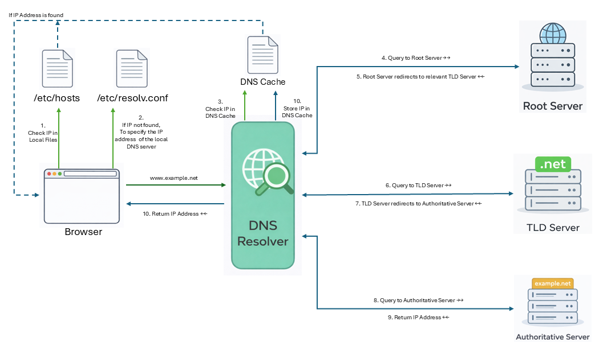

# 🌐 04-02: DNS Query Process

---

## 📌 Introduction

The **DNS query process** is the sequence of steps used to translate a hostname into its corresponding IP address.

The process starts from the **user’s local machine**. If the answer is not available locally, the request moves through the global DNS hierarchy step by step until the correct IP address is found.

---

## 🧭 DNS Query Process (Conceptual Steps)



### Step 1: Check Local DNS Files

Before contacting any DNS server, the user machine checks its local DNS configuration files:

- `/etc/hosts`  
  - Stores manually defined hostname-to-IP mappings  

- `/etc/resolv.conf`  
  - Specifies the IP address of the local DNS server  

---

### Step 2: Contact the Local DNS Server

If the hostname is not resolved locally, the user machine sends the query to the **Local DNS Server**.

💡 The Local DNS Server is also called:
- **DNS Resolver**
- **Recursive Resolver**

---

### Step 3: Check DNS Cache

The local DNS server first checks its **DNS cache**:

- If found → return immediately  
- If not → continue lookup  

---

### Step 4: Query the Root Server

If the answer is not cached, the resolver queries a **Root Server**.

- Root server provides the location of the appropriate **TLD server**

---

### Step 5: Query the TLD Server

The resolver queries the **Top-Level Domain (TLD) server**.

- TLD server returns the **authoritative nameserver** for the domain  

---

### Step 6: Query the Authoritative Nameserver

The resolver queries the **Authoritative Nameserver**.

- Stores actual DNS records  
- Returns the **final IP address**  

---

### Step 7: Return the Result

- Resolver caches the result  
- IP address is returned to the user machine  

---

## 🔄 Summary of Conceptual Flow

```text
User → Local Files → Resolver → Cache → Root → TLD → Authoritative → IP Address
```

---

## 🔁 Recursive vs Iterative Query

### 🔹 Recursive Query

- The client asks the resolver for the **final answer**
- The resolver performs all steps (Root → TLD → Authoritative)
- The client receives the final IP directly

💡 Used between:
- User → Local DNS Server

---

### 🔹 Iterative Query

- Each DNS server returns the **best possible answer**
- It may not be final, but points to the next server

Example flow:
- Root → "Ask TLD server"
- TLD → "Ask authoritative server"

💡 Used between:
- DNS servers (Resolver ↔ Root ↔ TLD ↔ Authoritative)

---

## 🧪 DNS Query Process (Example: www.example.net)


---

### Step 1: Check `/etc/hosts`

The system checks:

```bash
/etc/hosts
```

- If found → use IP  
- Otherwise → continue  

---

### Step 2: Check `/etc/resolv.conf`

The system checks:

```bash
/etc/resolv.conf
```

Example:
```bash
nameserver 10.0.2.3
```

- This gives the local DNS server  

---

### Step 3: Query Local DNS Server

The system sends:

```bash
www.example.net
```

- Resolver checks cache  
- If not found → continues  

---

### Step 4: Query Root Server

```bash
dig @a.root-servers.net www.example.net
```

Response:

```bash
net.    IN   NS   a.gtld-servers.net.
net.    IN   NS   e.gtld-servers.net.
```

👉 Root server points to `.net` TLD servers  

---

### Step 5: Query TLD Server

```bash
dig @a.gtld-servers.net www.example.net
```

Response:

```bash
example.net.   IN   NS   a.iana-servers.net.
example.net.   IN   NS   b.iana-servers.net.
```

👉 TLD server points to authoritative server  

---

### Step 6: Query Authoritative Server

```bash
dig @b.iana-servers.net www.example.net
```

Answer:

```bash
www.example.net.   IN   A   93.184.216.34
```

👉 Final IP address obtained  

---

### Step 7: Return Result

- Resolver caches result  
- Returns IP to user  

Final IP:

```bash
93.184.216.34
```

---

## 🖥️ Important Local DNS Files

| File | Purpose |
|------|--------|
| `/etc/hosts` | Manual hostname-to-IP mapping |
| `/etc/resolv.conf` | Defines local DNS server |
| `/etc/bind/db.root` | Stores root server information |
| `/etc/bind/named.conf.default-zones` | BIND root configuration |

---

## 📌 Key Points

- DNS starts from the **local machine**
- Local DNS server = **Resolver / Recursive Resolver**
- Cache improves performance
- Query flows: Root → TLD → Authoritative
- Recursive (client → resolver), Iterative (server → server)
- Final answer comes from authoritative server

---

## ✅ Final Flow in One Line

```text
User → /etc/hosts → /etc/resolv.conf → Resolver → Cache → Root → TLD → Authoritative → IP Address
```

---