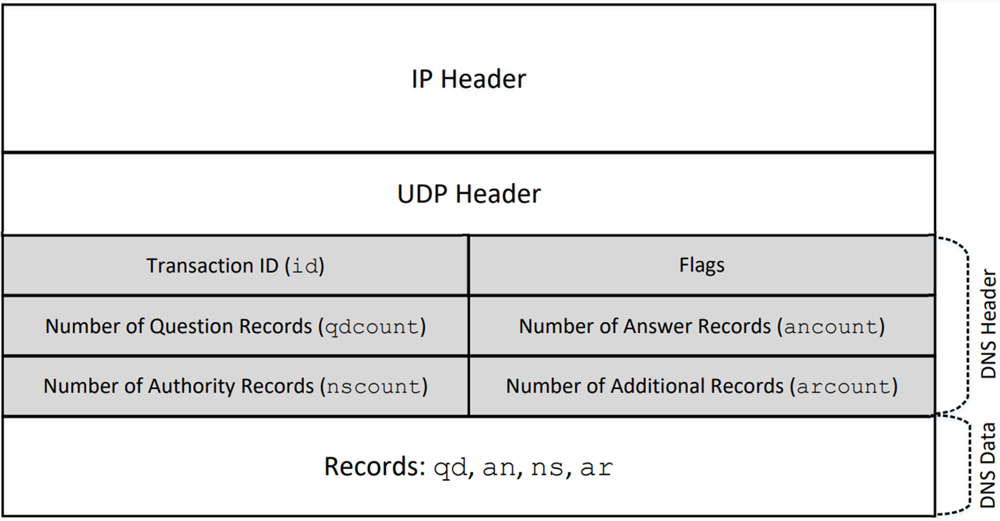

# 🌐 04-03: DNS Packets Construction

---

## 📌 Introduction

DNS packets are the core units of communication in the Domain Name System.
They carry queries (requests) and responses (answers) between clients and DNS servers.

---

## 🧱 DNS Packet Structure

A DNS packet follows a layered structure:

IP Header → UDP Header → DNS Header → DNS Data

- IP Header → handles routing
- UDP Header → uses port 53
- DNS Header → controls behavior
- DNS Data → contains actual query/response

---

## 🧩 DNS Header Fields

| Field   | Purpose                                      |
|--------|----------------------------------------------|
| id     | Unique transaction ID                        |
| flags  | Query/response control                       |
| qdcount| Number of Question Records                   |
| ancount| Number of Answer Records                     |
| nscount| Number of Authority Records                  |
| arcount| Number of Additional Records                 |

---

### ⚙️ Important Flags

- qr → 0 = query, 1 = response
- aa → authoritative answer
- rd → recursion desired
- ra → recursion available

---

## 📦 DNS Data Field

| Section | Description |
|--------|-------------|
| qd | Question (what we ask) |
| an | Answer (final IP) |
| ns | Authority (who knows) |
| ar | Additional (extra helpful info) |

---

## 📄 DNS Records (Concept)

Query:
www.example.com

Response breakdown:
- Question → what we asked
- Answer → IP of domain
- Authority → which server is responsible
- Additional → IP of that server

---

## 🛠️ DNS Structure in Scapy

Command:
    ls(DNS)

This shows all DNS fields:
- qd → question
- an → answer
- ns → authority
- ar → additional

---

## 🧪 DNS Query Record (DNSQR)

DNSQR = Question part of DNS packet

Fields:
- qname → domain name
- qtype → record type (A = IPv4)
- qclass → class (IN = Internet)

---

## 🧪 DNS Resource Record (DNSRR)

DNSRR = Actual data in response

Used in:
- Answer
- Authority
- Additional

Fields:
- rrname → domain name
- type → record type
- rclass → class
- ttl → cache duration
- rdata → actual value (IP / NS)

---

## 📡 Example: Sending a DNS Query

Code:
    
    #!/usr/bin/env python3
    from scapy.all import *
    
    IPpkt  = IP(dst='8.8.8.8')        # DNS server
    UDPpkt = UDP(dport=53)            # DNS port

    Qdsec  = DNSQR(qname='www.example.com')

    DNSpkt = DNS(
        id=100,
        qr=0,
        qdcount=1,
        qd=Qdsec
    )

    packet = IPpkt / UDPpkt / DNSpkt

    response = sr1(packet, timeout=2)

    if response:
        print(response[DNS].summary())

Explanation:
- IP → where to send
- UDP → DNS port
- DNSQR → question
- DNS → full packet
- "/" → combines layers
- sr1() → send + wait for reply

---

## 🖥️ Simple DNS Server

### Step 1: Receive Query

Code:
    
    #!/usr/bin/env python3
    from scapy.all import *
    from socket import socket, AF_INET, SOCK_DGRAM
    
    sock = socket(AF_INET, SOCK_DGRAM)
    sock.bind(("0.0.0.0", 1053))

    while True:
        data, addr = sock.recvfrom(4096)

        dns_req = DNS(data)
        query_name = dns_req.qd.qname.decode()

        print("Query:", query_name)

Explanation:
- Opens UDP server
- Receives DNS packet
- Extracts domain name

---

### Step 2: Build Response

Code:
    
    answer = DNSRR(
        rrname=dns_req.qd.qname,
        type="A",
        rdata="10.2.3.6",
        ttl=300
    )

Explanation:
- Creates answer record
- Maps domain → IP

---

### Step 3: Send Response

Code:
    
    dns_resp = DNS(
        id=dns_req.id,
        qr=1,
        aa=1,
        qd=dns_req.qd,
        qdcount=1,
        ancount=1,
        an=answer
    )

    sock.sendto(bytes(dns_resp), addr)

Explanation:
- id must match
- qr=1 → response
- aa=1 → authoritative
- attaches answer

---

## 🔄 Communication Flow

Client → DNS Query → Server
Server → DNS Response → Client

---

## 🧠 Key Takeaways

- DNS = layered protocol
- DNSQR → query
- DNSRR → answer
- Header controls everything
- Scapy allows custom packets

---

## 🚀 Why This Matters

- Debugging networks
- Packet analysis
- Security research
- Building DNS systems

---

## ✅ Final Flow

IP → UDP → DNS Header → Question → Answer → Authority → Additional

---