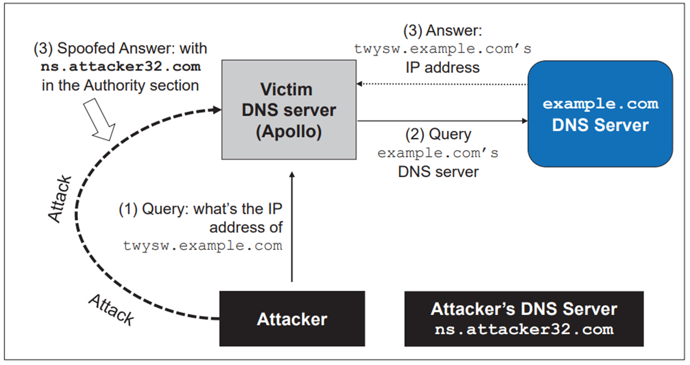

# 🧪 04-05: The Kaminsky Attack

## 📌 Definition

The Kaminsky Attack is a type of DNS cache poisoning attack that targets the **authority (NS) record** of a domain.

👉 Instead of poisoning a single hostname, it allows the attacker to:

- Inject a **malicious nameserver**
- Take control of the **entire domain**

---

## 🧠 Basic Idea

Normal DNS:

User → DNS → example.com DNS server → correct answer

After attack:

User → DNS → poisoned cache → attacker-controlled DNS → fake answers

💥 Entire domain resolution is now controlled by attacker

---

## ⚠️ Key Problem

DNS uses:

- UDP (no connection)
- Transaction ID (only 16-bit)

👉 This makes it possible to **guess or brute-force responses**

---

## 🧩 The Core Weakness

DNS validates responses using:

- Transaction ID
- Source port
- Matching question

👉 If attacker guesses these correctly → response is accepted

---

## 🔥 Main Strategy

Instead of attacking:

www.example.com

👉 The attacker queries:

random123.example.com  
random456.example.com  
randomXYZ.example.com  

These **do not exist**

---

## 💡 Why Random Subdomains?

Because:

- DNS server must ask authoritative server every time
- Cache cannot help (new name every time)

👉 This creates many opportunities to inject fake replies

---

## 🧪 Attack Steps



1. Attacker sends query for random subdomain  
   Example:
   random1.example.com  

2. DNS server forwards request to real DNS  

3. Attacker floods fake responses:

   - Different transaction IDs  
   - Same question  
   - Fake authority section  

4. If one matches → accepted  

5. Cache stores:

   example.com → ns.attacker32.com  

💥 Entire domain hijacked

---

## 📦 Key Injection

The attacker inserts:

example.com → ns.attacker32.com  

👉 Now all future queries go to attacker DNS

---

## 🧠 Simple Flow

Attacker → many fake replies  
DNS server → accepts one valid-looking reply  
Cache → poisoned  
Users → redirected  

---

## 🎯 Why This Is Powerful

| Feature | Impact |
|--------|-------|
| Random subdomains | Unlimited attempts |
| UDP protocol | No handshake |
| Small ID space | Easy guessing |
| Authority poisoning | Full domain takeover |

---

## 💥 Result of Attack

After success:

example.com → ns.attacker32.com  

Now:

- www.example.com → attacker  
- mail.example.com → attacker  
- login.example.com → attacker  

👉 Entire domain compromised

---

## 💻 Spoofed DNS Response (Kaminsky Attack Template)

```python
from scapy.all import *

# -------------------------------
# 🟢 IP + UDP Headers
# -------------------------------
ip = IP(dst='10.9.0.53', src='1.2.3.4')
udp = UDP(dport=33333, sport=53, chksum=0)

# -------------------------------
# 🟡 Question Section
# -------------------------------
Qdsec = DNSQR(qname='aaaaa.example.com')

# -------------------------------
# 🟡 Answer Section (Fake IP)
# -------------------------------
Anssec = DNSRR(
    rrname='aaaaa.example.com',
    type='A',
    rdata='1.1.1.1',
    ttl=259200
)

# -------------------------------
# 🔴 Authority Section (Poisoning)
# -------------------------------
NSsec = DNSRR(
    rrname='example.com',
    type='NS',
    rdata='ns.attacker32.com',
    ttl=259200
)

# -------------------------------
# 📦 DNS Packet
# -------------------------------
dns = DNS(
    id=0xAAAA,
    aa=1,
    rd=1,
    qr=1,
    qdcount=1,
    qd=Qdsec,
    ancount=1,
    an=Anssec,
    nscount=1,
    ns=NSsec
)

# -------------------------------
# 🚀 Final Packet
# -------------------------------
packet = ip / udp / dns
send(packet)
```

---

## 🧠 Explanation of Code

- **IP/UDP Headers**
  - `src='1.2.3.4'` → fake DNS server  
  - `dst='10.9.0.53'` → target DNS resolver  
  - `sport=53` → looks like real DNS traffic  

- **Question Section**
  - Must match the original query (`aaaaa.example.com`)  
  - Otherwise DNS server rejects the response  

- **Answer Section**
  - Returns fake IP: `1.1.1.1`  
  - Redirects victim to attacker-controlled destination  

- **Authority Section (Most Important)**
  - Injects:
    `example.com → ns.attacker32.com`  
  - This changes the trusted nameserver  

- **DNS Header**
  - `id=0xAAAA` → must match request  
  - `qr=1` → response  
  - `aa=1` → authoritative answer  

- **Final Packet**
  - Combines layers: `IP / UDP / DNS`  
  - Sent to victim DNS server  

---

## 🔗 Connection to Kaminsky Attack

- Uses random subdomain (`aaaaa.example.com`)  
- Forces DNS server to query repeatedly  
- Attacker sends many spoofed responses like this  
- If one matches → accepted  

💥 Result:

example.com → ns.attacker32.com  

👉 All subdomains now resolve via attacker-controlled DNS  
👉 Entire domain is hijacked  

---

## 🛡️ Defenses

To prevent Kaminsky attack:

- Random source ports (adds entropy)
- Random transaction IDs
- DNSSEC (strongest protection)
- Rate limiting DNS queries

---

## ✅ Key Takeaway

Kaminsky attack works by:

- Forcing repeated DNS queries using random subdomains
- Flooding fake responses
- Winning the race once
- Poisoning the authority section

🔥 Once successful → attacker controls the entire domain